# Tugas 7

## Table hasil benchmark
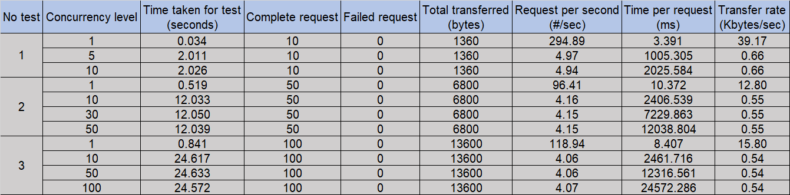  

## Benchmark dengan jumlah request 10:
### Concurrency Level 1:
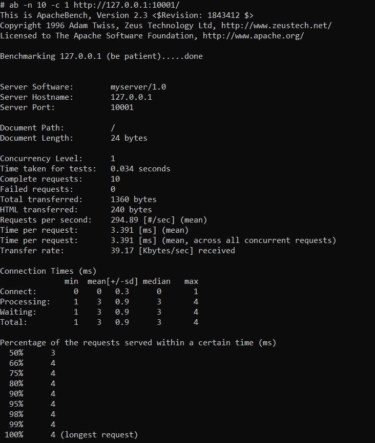

### Concurrency Level 5:
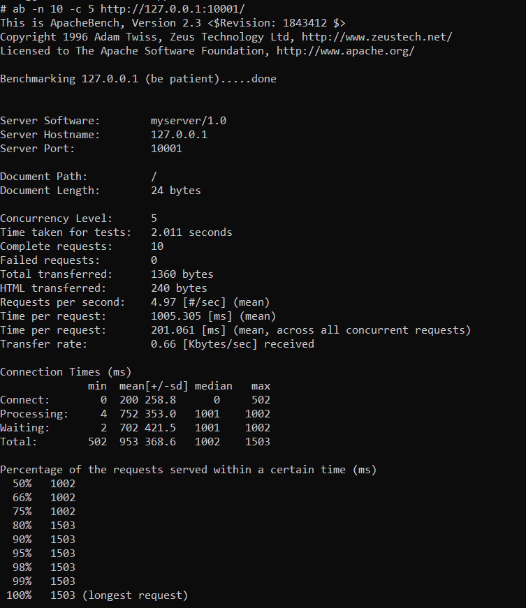

### Concurrency Level 10:
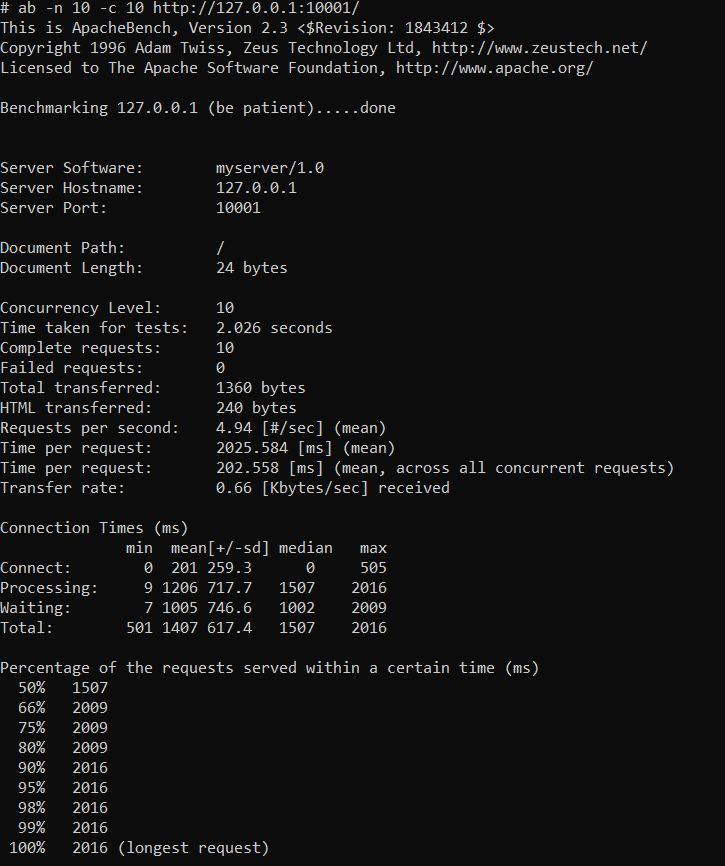  

## Benchmark dengan jumlah request 50:
### Concurrency Level 1:
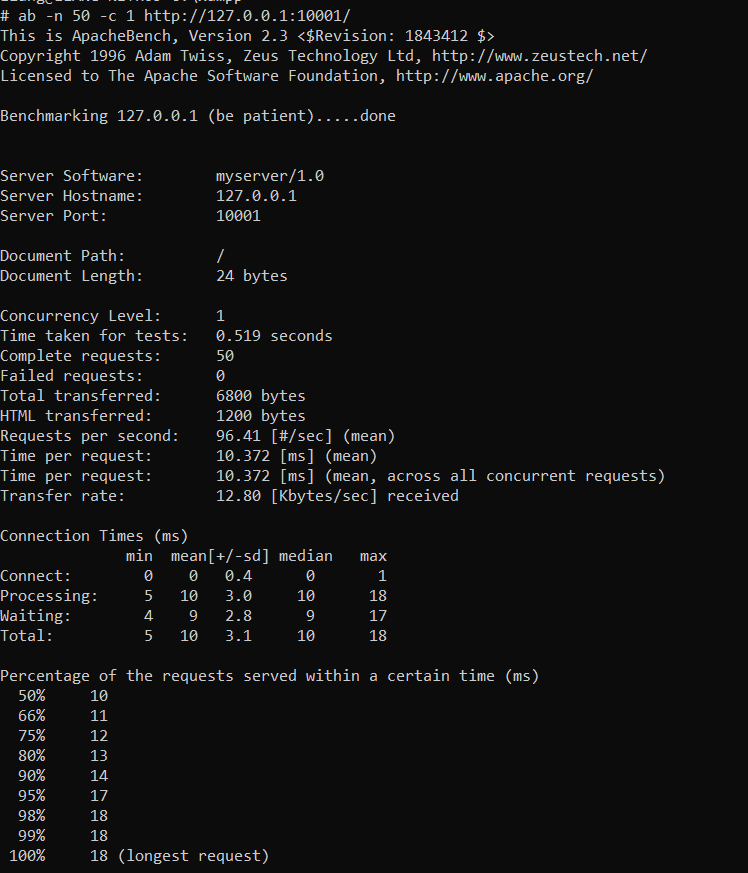

### Concurrency Level 10:
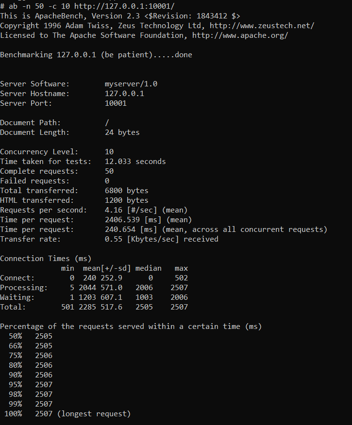

### Concurrency Level 30:
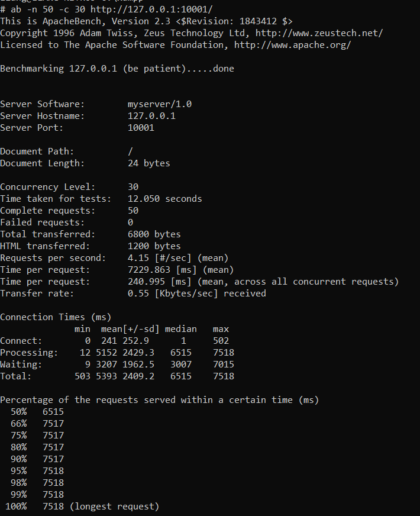

### Concurrency Level 50:
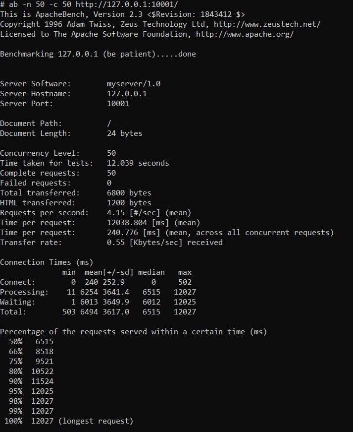  

## Benchmark dengan jumlah request 100:
### Concurrency Level 1:
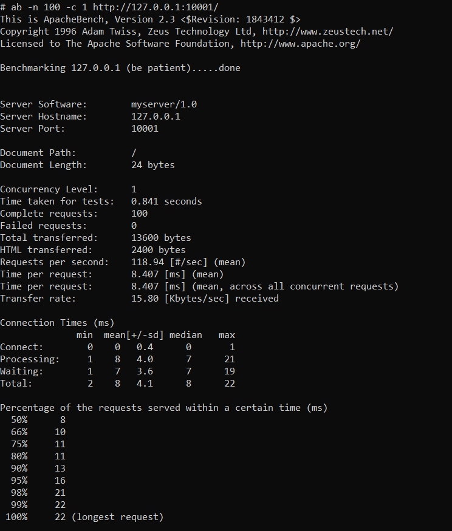

### Concurrency Level 10:
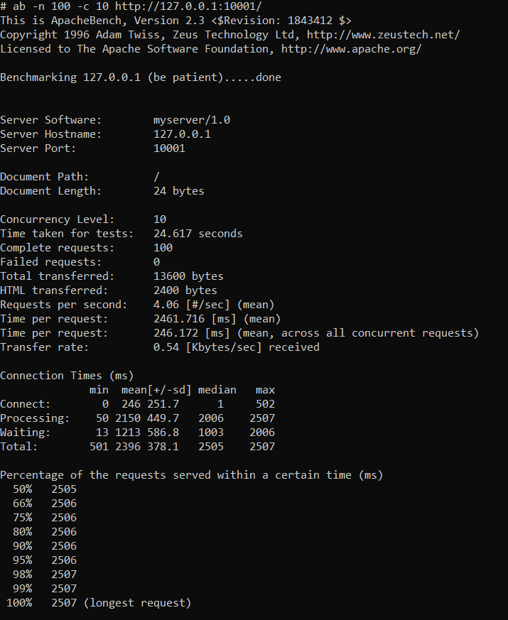

### Concurrency Level 50:
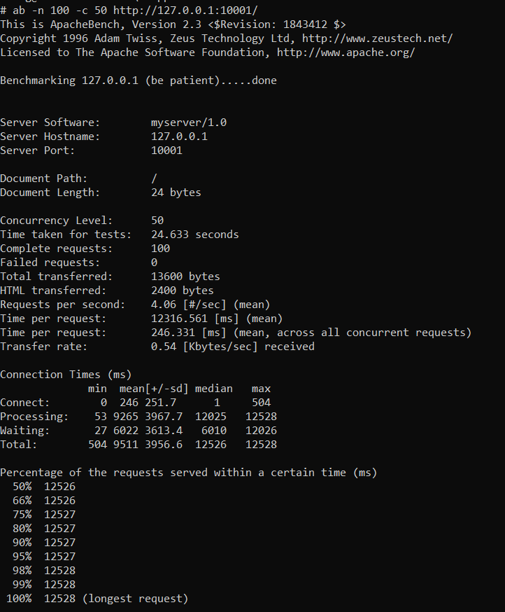

### Concurrency Level 100:
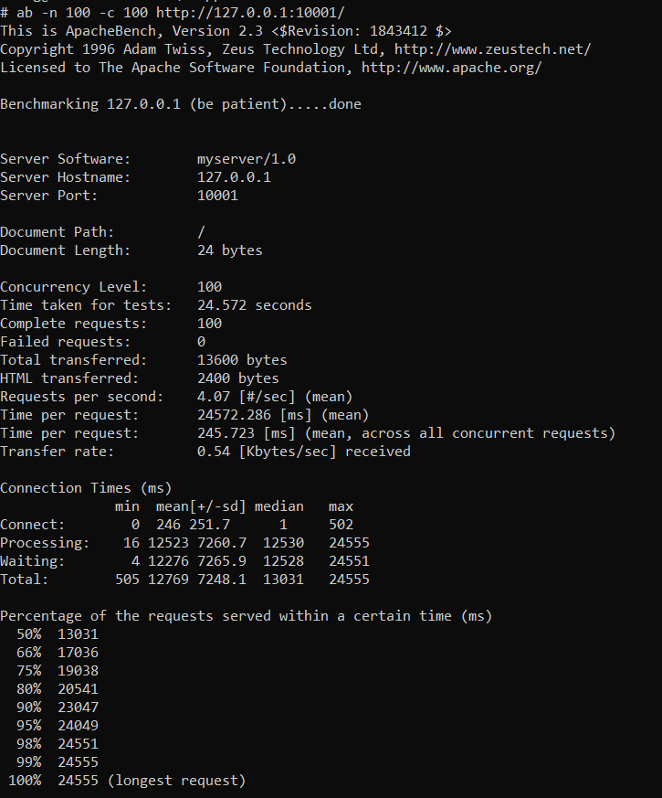